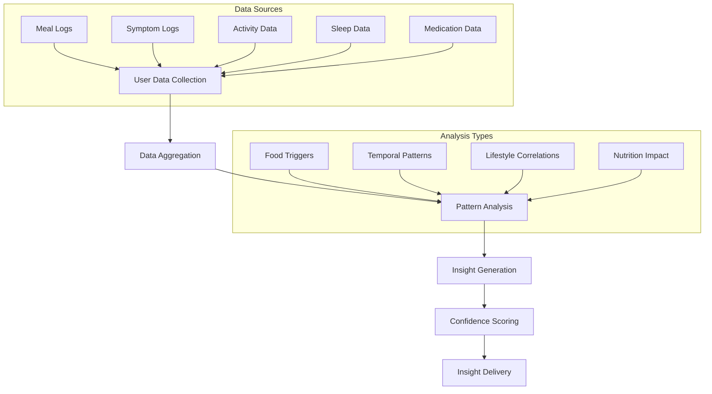

# GutCheck Insights System

## Overview

The GutCheck Insights System is an AI-powered analysis engine that processes user data to identify patterns, triggers, and trends in digestive health. It combines multiple data sources to provide personalized insights and actionable recommendations.

## 🔄 Data Processing Flow



## 🎯 Analysis Categories

### 1. Food Trigger Analysis
- **Input Data:**
  - Meal logs with ingredients
  - Symptom logs with timing
  - Previous trigger identifications
  
- **Analysis Process:**
  1. Track symptom occurrence after meals
  2. Calculate time windows between meals and symptoms
  3. Identify recurring ingredients in problematic meals
  4. Cross-reference with known trigger databases
  5. Consider portion sizes and combinations

- **Confidence Scoring:**
  - High (95%): Multiple consistent correlations
  - Medium (80%): Some correlations with variations
  - Low (60%): Potential patterns requiring more data

### 2. Pattern Recognition

- **Temporal Patterns:**
  - Time of day correlations
  - Meal timing impacts
  - Sleep-symptom relationships
  - Weekly/monthly cycles

- **Behavioral Patterns:**
  - Exercise impact
  - Stress correlations
  - Sleep quality relationships
  - Eating habits

- **Environmental Patterns:**
  - Location-based triggers
  - Seasonal variations
  - Travel impact

### 4. Medication Analysis:
- **Medication Tracking:**
  - Type and dosage
  - Timing of administration
  - Frequency and adherence
  - Source: HealthKit integration

- **Interaction Analysis:**
  - Medication-food interactions
  - Medication timing vs meals
  - Side effect correlations
  - Effectiveness patterns

- **Privacy Considerations:**
  - Encrypted storage
  - Local-only processing
  - HealthKit permissions
  - Sensitive data handling

### 5. Trend Analysis

- **Short-term Trends (7-14 days):**
  - Recent symptom frequency
  - Dietary changes
  - Immediate impacts of interventions

- **Long-term Trends (30+ days):**
  - Overall symptom severity
  - Treatment effectiveness
  - Lifestyle modification results

## 🧮 Insight Generation Algorithm

### Step 1: Data Collection
```swift
struct HealthData {
    let meals: [Meal]
    let symptoms: [Symptom]
    let activities: [Activity]
    let timeframe: DateInterval
}
```

### Step 2: Pattern Detection
1. **Time-Based Analysis:**
   ```swift
   func analyzeTimePatterns(data: HealthData) -> [TimePattern] {
       // Group symptoms by time of day
       // Calculate meal-to-symptom intervals
       // Identify peak symptom times
   }
   ```

2. **Food Analysis:**
   ```swift
   func analyzeFoodPatterns(data: HealthData) -> [FoodPattern] {
       // Group symptoms by consumed foods
       // Calculate ingredient frequencies
       // Identify common combinations
   }
   ```

3. **Lifestyle Analysis:**
   ```swift
   func analyzeLifestylePatterns(data: HealthData) -> [LifestylePattern] {
       // Correlate activities with symptoms
       // Analyze sleep impact
       // Consider stress factors
   }
   ```

### Step 3: Confidence Calculation

```swift
struct ConfidenceScore {
    let baseScore: Double          // Initial correlation strength
    let dataPoints: Int           // Number of occurrences
    let consistency: Double       // Pattern consistency
    let timespan: TimeInterval    // Data collection period
    
    var finalScore: Double {
        let dataFactor = min(dataPoints / 10, 1.0)
        let timeFactor = min(timespan.days / 30, 1.0)
        return baseScore * dataFactor * consistency * timeFactor
    }
}
```

## 🎯 Insight Types

### 1. Medication Insights
```json
{
    "type": "MedicationInsight",
    "medication": {
        "name": "Generic Name (Brand Name)",
        "dosage": "10mg",
        "frequency": "Daily",
        "timing": "Morning",
        "source": "HealthKit"
    },
    "analysis": {
        "adherence": 0.95,
        "effectiveness": 0.82,
        "interactions": [
            {
                "type": "Food",
                "item": "Dairy",
                "impact": "Reduced absorption",
                "recommendation": "Take 2 hours before/after dairy"
            },
            {
                "type": "Timing",
                "observation": "Better tolerance when taken with food",
                "confidence": 0.78
            }
        ],
        "sideEffects": [
            {
                "symptom": "Mild nausea",
                "timing": "30-60 minutes after dose",
                "frequency": "Occasional",
                "mitigation": "Take with food"
            }
        ]
    },
    "recommendations": [
        "Maintain current morning schedule",
        "Continue taking with breakfast",
        "Avoid dairy products for 2 hours"
    ],
    "privacyLevel": "High",
    "dataLocation": "Local"
}
```

### 2. Food Triggers
```json
{
    "type": "FoodTrigger",
    "trigger": "Dairy",
    "confidence": 0.85,
    "evidence": {
        "occurrences": 12,
        "timeWindow": "2-4 hours",
        "symptomCorrelation": 0.78
    },
    "recommendations": [
        "Consider lactose-free alternatives",
        "Test different dairy products separately",
        "Monitor portion sizes"
    ]
}
```

### 2. Temporal Patterns
```json
{
    "type": "TemporalPattern",
    "pattern": "Morning Symptoms",
    "confidence": 0.92,
    "evidence": {
        "peakTime": "6:00-9:00 AM",
        "frequency": "75% of symptoms",
        "correlatedFactors": [
            "Large evening meals",
            "Late dining"
        ]
    }
}
```

### 3. Lifestyle Correlations
```json
{
    "type": "LifestyleCorrelation",
    "factor": "Exercise",
    "impact": "Positive",
    "confidence": 0.88,
    "evidence": {
        "symptomReduction": "30%",
        "optimalDuration": "30-45 minutes",
        "bestTime": "Morning"
    }
}
```

## 📊 Visualization Types

1. **Trend Charts:**
   - Symptom frequency over time
   - Trigger occurrence rates
   - Improvement tracking

2. **Pattern Heatmaps:**
   - Time-of-day distributions
   - Day-of-week patterns
   - Seasonal variations

3. **Correlation Networks:**
   - Food-symptom relationships
   - Activity-impact connections
   - Multi-factor patterns

## 🎯 Recommendation Generation

### Process:
1. **Pattern Identification:**
   - Analyze recurring issues
   - Identify successful interventions
   - Consider user preferences

2. **Action Item Creation:**
   - Break down into manageable steps
   - Prioritize by impact potential
   - Consider implementation ease

3. **Follow-up Analysis:**
   - Track recommendation adherence
   - Measure effectiveness
   - Adjust based on results

### Example Recommendation:
```json
{
    "type": "DietaryChange",
    "title": "Dairy Reduction Plan",
    "priority": "High",
    "steps": [
        {
            "action": "Replace milk with lactose-free alternative",
            "timeframe": "Next 7 days",
            "measurable": true
        },
        {
            "action": "Test yogurt tolerance",
            "timeframe": "Week 2",
            "measurable": true
        }
    ],
    "expectedOutcome": "Reduced bloating and discomfort",
    "monitoringPlan": "Daily symptom tracking"
}
```

## 🔄 Continuous Improvement

The system continuously improves through:
1. User feedback on insights
2. Pattern validation over time
3. Correlation strength updates
4. New pattern discovery
5. Recommendation effectiveness tracking

This creates a learning loop that enhances:
- Pattern detection accuracy
- Recommendation relevance
- Confidence scoring
- User personalization

## Medication Data Source

### Real-time HealthKit Integration

Medication data is sourced from Apple HealthKit using **real-time observers** rather than periodic polling. This approach provides several advantages:

#### **Real-time Updates (Recommended)**
- **Immediate Notification**: HealthKit notifies the app instantly when medication data changes
- **Battery Efficient**: Uses HealthKit's built-in observer pattern instead of background fetch
- **Better User Experience**: Users see medication updates in real-time
- **Background Delivery**: App can receive updates even when in background

#### **Implementation Details**
```swift
// Start observing medication changes
func startObservingMedications() async {
    let medicationTypes: [HKObjectType] = [
        .medicationDispenseType(),
        .medicationOrderType(),
        .medicationRecordType()
    ]
    
    for medicationType in medicationTypes {
        let query = HKObserverQuery(sampleType: medicationType, predicate: nil) { [weak self] _, completion, error in
            // Immediately fetch updated data when changes occur
            Task { @MainActor in
                await self?.fetchLatestMedications()
                completion()
            }
        }
        healthStore.execute(query)
    }
}
```

#### **Data Flow**
1. **User takes medication** → Health app records it
2. **HealthKit detects change** → Immediately notifies GutCheck
3. **App processes update** → Fetches latest medication data
4. **UI updates** → User sees medication in real-time
5. **Insights updated** → Medication interactions analyzed

#### **Privacy & Security**
- **Local Processing**: All medication data processed on-device
- **Encrypted Storage**: Sensitive data encrypted with CryptoKit
- **No Cloud Sync**: Medication data never leaves the device
- **HealthKit Compliance**: Follows Apple's privacy guidelines

#### **Fallback Options**
- **Manual Entry**: Users can manually log medications if HealthKit unavailable
- **Offline Mode**: App functions without HealthKit connection
- **Data Recovery**: Local backup of medication history

### Alternative: Daily Polling (Not Recommended)
While possible, daily polling would:
- Use more battery
- Miss real-time medication events
- Provide poorer user experience
- Require background app refresh permissions
