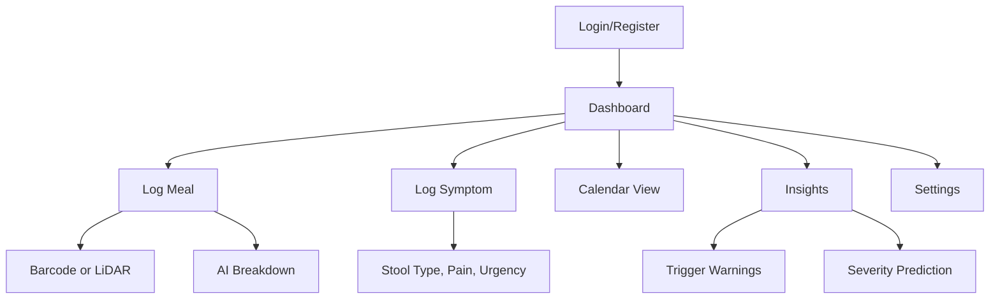

# GutCheck App — SwiftUI Architecture Plan

This document outlines the Swift file structure, responsibilities, and flow logic for the GutCheck iOS app, focused on gastrointestinal symptom tracking, meal logging, and AI analysis.

---

## 📁 `GutCheck/`
### Main App Entry
#### 🧾 `GutCheckApp.swift`
- App entry point using SwiftUI lifecycle.
- Initializes Firebase, Core Data, and AppState.
- Observes user authentication state.

---

## 📁 `Models/` — Core data structures
- `Meal.swift`: Represents a meal entry.
- `Symptom.swift`: Represents symptom log.
- `UserProfile.swift`: Stores HealthKit user info.
- `FoodItem.swift`: Ingredient & nutrition metadata.

---

## 📁 `Views/` — UI Screens

### 📂 `Dashboard/`
- `DashboardView.swift`: Today's logs + actions.
- `DashboardCardView.swift`: Reusable summary/info cards.

### 📂 `MealLogging/`
- `LogMealView.swift`: Meal entry screen.
- `SearchFoodView.swift`: Text-based lookup.
- `BarcodeScannerView.swift`: AVFoundation scan.
- `LiDARScannerView.swift`: Portion scanner.
- `MealDetailView.swift`: Nutrition breakdown.
- `MealConfirmationView.swift`: Final review screen.

### 📂 `SymptomLogging/`
- `LogSymptomView.swift`: Entry form for symptoms.
- `SymptomHistoryView.swift`: Prior symptoms list.
- `SymptomExplanationView.swift`: Info about scales.

### 📂 `Calendar/`
- `UnifiedCalendarView.swift`: Meals + symptoms.
- `CalendarDetailView.swift`: Per-day overview/edit.

### 📂 `Analysis/`
- `InsightsView.swift`: Charts and trends.
- `TriggerAlertView.swift`: AI symptom-food links.
- `InsightDetailView.swift`: Deep dive on correlations.

### 📂 `Settings/`
- `SettingsView.swift`: Export, preferences, privacy.
- `PrivacyPolicyView.swift`: In-app policy viewer.
- `DebugView.swift`: Dev-only debugging tools.

### 📂 `Authentication/`
- `LoginView.swift`: Google, Apple, Email login.
- `RegisterView.swift`: New account creation.
- `WelcomeView.swift`: First-launch splash screen.

---

## 📁 `ViewModels/` — Logic/Bindings for Views

- `MealLoggingViewModel.swift`
- `SymptomLoggingViewModel.swift`
- `DashboardViewModel.swift`
- `AuthViewModel.swift`
- `CalendarViewModel.swift`
- `InsightViewModel.swift`
- `SettingsViewModel.swift`

---

## 📁 `Services/` — Utilities & Shared Logic

- `AIAnalysisService.swift`: AI/ML processing.
- `FirebaseManager.swift`: Firestore wrapper.
- `SyncQueueManager.swift`: Offline sync logic.
- `LocalStorageService.swift`: Core Data helper.
- `BarcodeScanService.swift`: AVCaptureSession tools.
- `MockDataService.swift`: Dummy/testing data.
- `HealthKitManager.swift`: HealthKit ingestion.

---

## 📁 `Resources/`
- `Assets.xcassets`: App colors, icons.
- `Localizable.strings`: i18n/language.
- `GoogleService-Info.plist`: Firebase keys (in .gitignore).
- `PrivacyPolicy.txt`: App privacy policy.

---

## 📁 `Tests/`
- `MealLoggingTests.swift`
- `SymptomLoggingTests.swift`
- `InsightEngineTests.swift`
- `FirebaseIntegrationTests.swift`
- `OfflineModeTests.swift`

---

## 🔁 App Flow Diagram

---

_Last Updated: August 2025_
